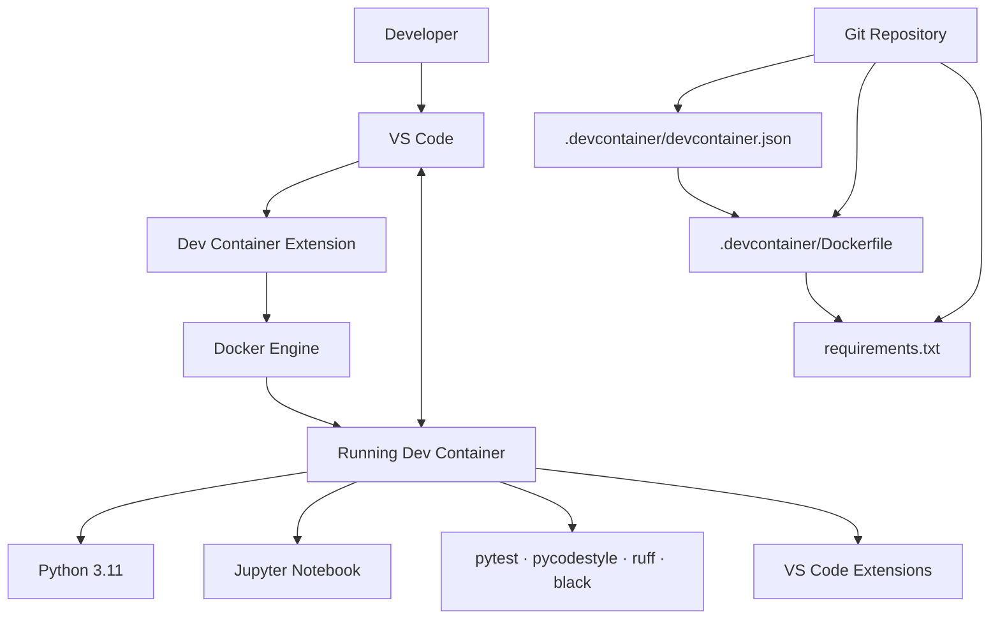

# [name your project]

**Machine Learning Containerised Poject**

## First Start Guide

### Prerequisites

- Docker Desktop (Windows/macOS) or Docker Engine (Linux)
- Visual Studio Code
- Dev Containers extension

### Opening the Project

1. Clone the repository:

```bash
git clone <repository-url>
cd <repository>
```

2. Open the folder in VS Code.

3. When prompted, select:

```text
Reopen in Container
```

or use:

```text
⌘⇧P (Ctrl+Shift+P)
Dev Containers: Reopen in Container
```

4. Wait for the initial image build.

The first build may take several minutes because Python packages must be downloaded and installed.

### Verifying the Environment

Open a terminal inside the container and run:

```bash
python --version
pytest --version
pycodestyle --version
```

Expected Python version:

```text
Python 3.11.x
```

### Working with Jupyter Notebooks

Create a notebook:

```text
File → New File → Jupyter Notebook
```

or create a file ending in:

```text
.ipynb
```

Verify the kernel with:

```python
import numpy as np
import pandas as pd

print(np.__version__)
print(pd.__version__)
```

### Rebuilding the Container

When `requirements.txt`, `Dockerfile`, or `devcontainer.json` changes:

```text
⌘⇧P (Ctrl+Shift+P)
Dev Containers: Rebuild Container
```

### Notes

- The development environment runs inside Docker.
- Source code remains on the host machine.
- The setup works on macOS, Linux, and Windows.
- Python packages are version-pinned for reproducibility.
- Jupyter, pytest, pycodestyle, ruff, and black are preconfigured.

## .gitignore

## Dev Container Environment

### Components of Dev Container Interaction



### requirements.txt

List of Python libraries and versions that should be installed inside the container.

`requirements.txt` gives you:

- [x] Curriculum compliance
- [x] Jupyter notebooks
- [x] Unit testing (`pytest`)
- [x] Style checks (`pycodestyle`)
- [x] Fast linting (`ruff`)
- [x] Auto-formatting (`black`)

### .devcontainer/devcontainer.json

Defines the development experience:

- Container build configuration
- Workspace mounting
- VS Code extensions
- VS Code settings
- Default user and environment customization

### .devcontainer/Dockerfile

Defines the container image:

- Python version
- Operating system packages
- Project dependencies
- User configuration
- Runtime environment

Together, `devcontainer.json`, `Dockerfile`, and `requirements.txt` create a reproducible machine-learning environment that works consistently on macOS, Linux, and Windows.
