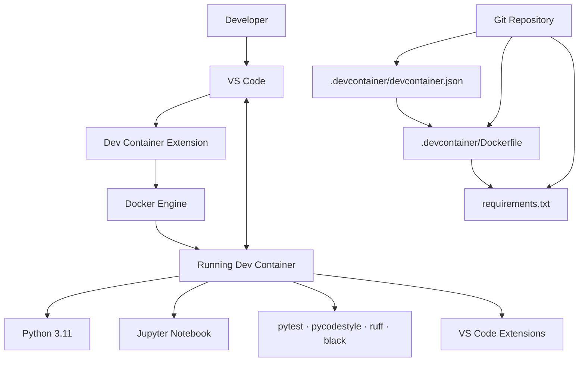

# Modern AI Project (AI Academy by DLH)

## .gitignore

## Dev Container Environment

### Components of Dev Container Interaction

### requirements.txt

List of Python libraries and versions that should be installed inside the container.

`requirements.txt` gives you:

- [x] Curriculum compliance
- [x] Jupyter notebooks
- [x] Unit testing (`pytest`)
- [x] Style checks (`pycodestyle`)
- [x] Fast linting (`ruff`)
- [x] Auto-formatting (`black`)

### .devcontainer/devcontainer.json

Defines the development experience:

- Container build configuration
- Workspace mounting
- VS Code extensions
- VS Code settings
- Default user and environment customization

### .devcontainer/Dockerfile

Defines the container image:

- Python version
- Operating system packages
- Project dependencies
- User configuration
- Runtime environment

Together, `devcontainer.json`, `Dockerfile`, and `requirements.txt` create a reproducible machine-learning environment that works consistently on macOS, Linux, and Windows.