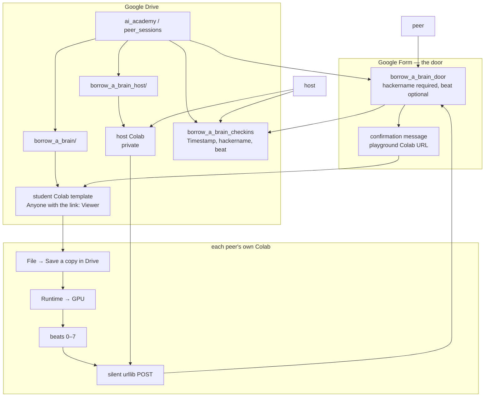
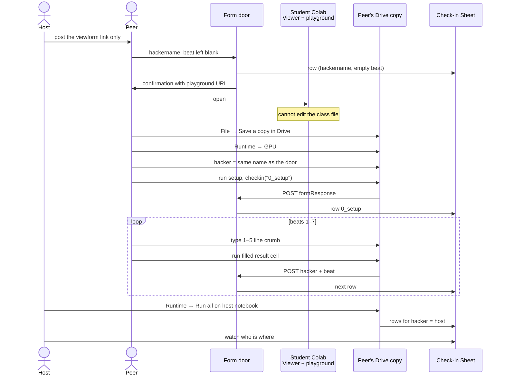

# borrow a brain

Hands-on peer session for transfer learning, plus a small Google Drive system that lets people walk in through a Form and quietly pings a Sheet as they finish each beat.

This folder is the reusable copy. The Holberton checker files stay next door in `transfer_learning/`. An older draft still sits in `peer_session/` (CIFAR-sized NOTES and notebooks). Ignore that one. Use these files.

Session length is about 30 minutes. No slides. Peers type a 1–5 line crumb, run the filled cell under it, look, go on. Traditional and `list(map(lambda …))` recipes are stacked as fenced python blocks. Colab HTML tables overlap columns, so we never use those.

Data is eight 96×96 JPEGs baked into a collapsed form cell. Nobody downloads CIFAR-10, tfds, Caltech, or a cats-and-dogs zip. The only later download is MobileNetV2 ImageNet weights (~14 MB from Google).

**Do not send `borrow_a_brain_host.ipynb` to students.**

## live Drive layout (this session)

Account: `sabra.the.meng`. Connector talks to Drive, not to Forms or Sheets, so the door and the progress table are ordinary Google files that the notebooks POST into.

Parent path: `ai_academy / peer_sessions / …`

| piece | title | id / url |
|---|---|---|
| parent folder | `ai_academy` | `187AX4PgT7pdseUGWeLm8cmNTmvWTYIxD` |
| sessions folder | `peer_sessions` | `1X7L1TTjcmj6_iIv32tU_wkMoJNlJv2JX` |
| **entry link (share this)** | Form view | https://docs.google.com/forms/d/e/1FAIpQLSf6fVhSpnjTlidl0XUw1uq-BcJ6ZH-457rpULqI8IyXw1mqZA/viewform |
| Form file | `borrow_a_brain_door` | `1mqDI-NqXk98MkkIUvmA05LFNYdw-TZ3V_H2p0NLa1FA` |
| progress Sheet | `borrow_a_brain_checkins` | https://docs.google.com/spreadsheets/d/1nXEQNHVFCdBYJ-c3RXWkbjRQJHdZjXIA9ms9ZTszDr4/edit |
| student folder | `borrow_a_brain` | `1JCk2UMptbyN85yiaKUF0HYRvBNf2qzwZ` |
| **student Colab** | `borrow_a_brain.ipynb` | https://colab.research.google.com/drive/1-fVPGnbLEgawq2k_N0AyHPZFLuCnlGJk |
| host folder | `borrow_a_brain_host` | `1tiBmkCdRgbmBSYbJsH5q0lMrTBMSx8y1` |
| **host Colab (private)** | `borrow_a_brain_host.ipynb` | https://colab.research.google.com/drive/1UPYOcfvC4pyXoGWgvhVjcKbiuXG56_9e |

Leftovers you can bin when convenient: `borrow_a_brain_pre_checkin.ipynb`, `borrow_a_brain_quiet_setup.ipynb`, and the matching host files. Drive lets two files share a title. We rename the old one instead of duplicating.

## how the system is built

Two machines, not one.

The **Form is the door**. You post one `viewform` link. A peer types a required `hackername`, leaves `beat` blank, submits, and the confirmation page hands them the playground Colab URL. Forms cannot see Colab cell runs. Attendance is the first row. Progress is later rows.

The **Colab is the room**. The class file is **Anyone with the link → Viewer**. Confirmation uses the playground hash so they cannot overwrite the class file:

```
https://colab.research.google.com/drive/<STUDENT_ID>#offline=true&sandboxMode=true
```

Each person then **File → Save a copy in Drive**, then **Runtime → GPU**, then types the same `hacker` in the notebook. One shared runtime would steal one GPU and stack eight kernels on top of each other.

The **Sheet is the scoreboard**. Filled result cells silently `POST` to the same Form’s `formResponse` URL. Linked responses land as Timestamp, hackername, beat. The host notebook does the same with `hacker = "host"`.

```
CHECKIN_URL = https://docs.google.com/forms/d/e/1FAIpQLSf6fVhSpnjTlidl0XUw1uq-BcJ6ZH-457rpULqI8IyXw1mqZA/formResponse
ENTRY_HACKER = entry.1342343581
ENTRY_BEAT   = entry.13950344
```

Beats: `0_setup`, `1_preprocess`, `2_brain`, `3_freeze`, `4_head`, `5_aug`, `6_coach`, `7_predict`.

`checkin` skips if `hacker` is empty or `"yourname"`, times out at 8 seconds, and never fails the lesson if the ping fails.

## block diagram

Who owns which file, and which arrows actually exist.



Forms never watch Colab. Colab never writes the Sheet directly. The only progress wire is the notebook POSTing into `formResponse`, which Google already knows how to file.

## sequence diagram

What a peer actually does, and when the Sheet moves.



## the two notebooks

Same 32 cells. Same baked pictures. Same check-in helper. The only real difference is the typing cells.

| | `borrow_a_brain.ipynb` | `borrow_a_brain_host.ipynb` |
|---|---|---|
| who | peers | you, dry run |
| Drive folder | `borrow_a_brain` | `borrow_a_brain_host` |
| sharing | Anyone with the link → **Viewer** | private |
| `hacker` | they type `"yourname"` → their door name | already `"host"` |
| typing cells | comment + empty assignment | traditional recipe filled |
| how to run | type, run, look | Runtime → Run all |
| Colab name in metadata | `borrow_a_brain.ipynb` | `borrow_a_brain_HOST.ipynb` |

Notebook JSON is Colab-native: `metadata.colab` (`name`, `toc_visible: true`, empty `provenance`) plus a `metadata.id` on every cell. Recreate from a blank Colab if a local `.ipynb` ever looks ugly in Drive. Uploading a Colab-native file is fine; creating the file inside Colab looks cleaner.

Pictures cell uses Colab form collapse so the base64 does not fill the screen:

```python
#@title pictures (baked in) {display-mode: "form"}
```

Eight JPEGs, `tf.io.decode_jpeg`, resize to `IMG_SIZE` if needed. Variables after setup:

- `images` — `(8, 96, 96, 3)` uint8
- `labels` — `(8,)` int64, 0 = cat, 1 = dog
- `class_names` = `["cat", "dog"]`
- `IMG_SIZE` = `(96, 96)`

### cell map

| cells | beat | what |
|---|---|---|
| 0 | — | intro markdown (Save a copy, GPU, same hackername) |
| 1 | 0 | `## 0 · setup` |
| 2 | 0 | connector: `import tensorflow as tf`, print GPU |
| 3 | 0 | imports: keras, numpy, pyplot, `%matplotlib inline` |
| 4 | 0 | names: `IMG_SIZE`, `class_names` |
| 5 | 0 | pictures, form-collapsed |
| 6 | 0 | 2×4 grid |
| 7 | 0 | `CHECKIN_URL`, entry ids, `def checkin` |
| 8 | 0 | `hacker = …` |
| 9 | 0 | `checkin("0_setup")` |
| 10–12 | 1 | preprocess markdown + typing + min/max preview |
| 13–15 | 2 | MobileNet + GAP extractor, print `(8, 1280)` |
| 16–18 | 3 | freeze `base.layers`, print 0 trainable params |
| 19–21 | 4 | tiny head, compile Adam(1e-3), 1 epoch |
| 22–24 | 5 | aug Sequential, 4 views of `images[0]`, no fit |
| 25–27 | 6 | unfreeze last 20 of **`base`**, BN stays frozen, Adam(1e-5), 1 epoch |
| 28–30 | 7 | predict 8, titles `pred (true)` |
| 31 | — | closing markdown |

Typing cells stay 1–5 lines. Plotting, compile, and `fit` live in the filled result cell under the crumb. Surrounding story is full sentences, not telegram-cut wording.

### expected first sip

One pass over 8 pictures with a frozen brain and a new tiny head is a coin flip. Accuracy around 0.5 is the goal of beat 4, not a bug. Loss around 0.9 is “a bit confused.” Two-class random sits near `ln(2) ≈ 0.69`. Perfect 1.0 on 8 points is overfitting, not the win.

### load-bearing details

- JPEG pixels are 0–255. `mobilenet_v2.preprocess_input` stretches to about -1..1. `/255` is a different room. If min/max print `0..1`, they used the wrong glasses.
- Build `base` with `include_top=False`, `weights="imagenet"`, `input_shape=(96, 96, 3)`. Call it with `training=False` so BatchNorm stays in inference.
- Freeze and unfreeze **`base.layers`**, never `model.layers[-20:]`. The sandwich says backbone.
- After flipping `trainable`, recompile. Keras will not pick up the new flags otherwise.
- Keep `keras.layers.BatchNormalization` frozen during the whisper of fine-tune.
- Beat 5 does not wrap `aug` into `model` and does not fit.
- `from tensorflow import keras`. Do not `pip install keras`. tensorflow is already on Colab.
- Never CIFAR, never tfds, never 224, never 5+ epochs, never Caltech, never a cats-and-dogs zip.

## Form and Sheet settings

These are easy to get wrong, and they break the pings.

Form:

- Collect email **off**. You already have `hackername`.
- Limit to 1 response **off**. Setup plus seven beats is eight POSTs from the same person.
- Anyone with the link can respond.
- Question 1: `hackername`, short answer, required.
- Question 2: `beat`, short answer, optional (blank on the door, filled by notebooks).
- Presentation confirmation is a **pasted playground URL**, not a custom button. Forms cannot put a real Colab button there.
- Responses → link to a Sheet titled `borrow_a_brain_checkins`. Columns: Timestamp, hackername, beat.

To steal new `entry.*` ids for the next session: open the Form’s `viewform`, view source, search `entry.`. The `name=` on each input is what `urllib` must POST.

## how to reuse this for the next session

Keep the shape. Change the names.

1. Nested Drive folder `ai_academy/peer_sessions/<session_slug>/` for students, and a neighboring `<session_slug>_host/` for you. Never dump files in Drive root.
2. Unique titles. If you need to replace a notebook, rename the old one (`*_old`, `*_pre_checkin`) then upload. Do not create a second file with the same title.
3. Drive `create` uploads content. Drive `update` on this connector is title and parent only. It cannot rewrite notebook cells. Replacement means new file, then point the Form at the new id.
4. Student file: Anyone with the link → Viewer. Confirmation URL is `/drive/<id>#offline=true&sandboxMode=true`.
5. Host file stays private. Dry-run with Runtime → Run all. Confirm the Sheet gets `host` rows. Confirm student typing cells are still comments.
6. New Form, new Sheet. Copy the check-in helper, paste the new `formResponse` URL and `entry.*` ids.
7. Share only the `viewform` link. Never the host notebook, never the Sheet, never a GPU-editable class file.
8. Pictures stay tiny and baked in. Luxembourg Colab was unusably slow on Toronto CIFAR and later hung on Unsplash CDN.
9. Typing crumbs stay 1–5 lines that tell a story. Result cells stay filled. Traditional and lambda stay stacked fences, never an HTML table.
10. File names lowercase, no spaces, matching the school repos.

A large notebook (hundreds of KB of npz-in-cell) failed the Drive upload. JPEG-packed ~44 KB files went through. Stay in that neighborhood.

## dry-run checklist

On the host Colab, GPU, Runtime → Run all:

- [ ] eight pictures, no dataset download
- [ ] beat 1 min/max around -1..1
- [ ] beat 2 prints `(8, 1280)`
- [ ] beat 3 prints `0` trainable params on `base`
- [ ] beat 4 accuracy bar appears (coin-flip is fine)
- [ ] beat 5 shows four different-ish cats
- [ ] beat 6 trainable params on `base` is no longer 0; 1e-5 epoch runs
- [ ] beat 7 titles show predicted (true)
- [ ] Sheet has `host` rows for `0_setup` through `7_predict`
- [ ] student typing cells are comments only

## files in this folder

- `README.md` — this playbook
- `borrow_a_brain.ipynb` — student copy (setup filled, typing cells empty)
- `borrow_a_brain_host.ipynb` — host copy (traditional filled)

Go touch grass. Or cats.
