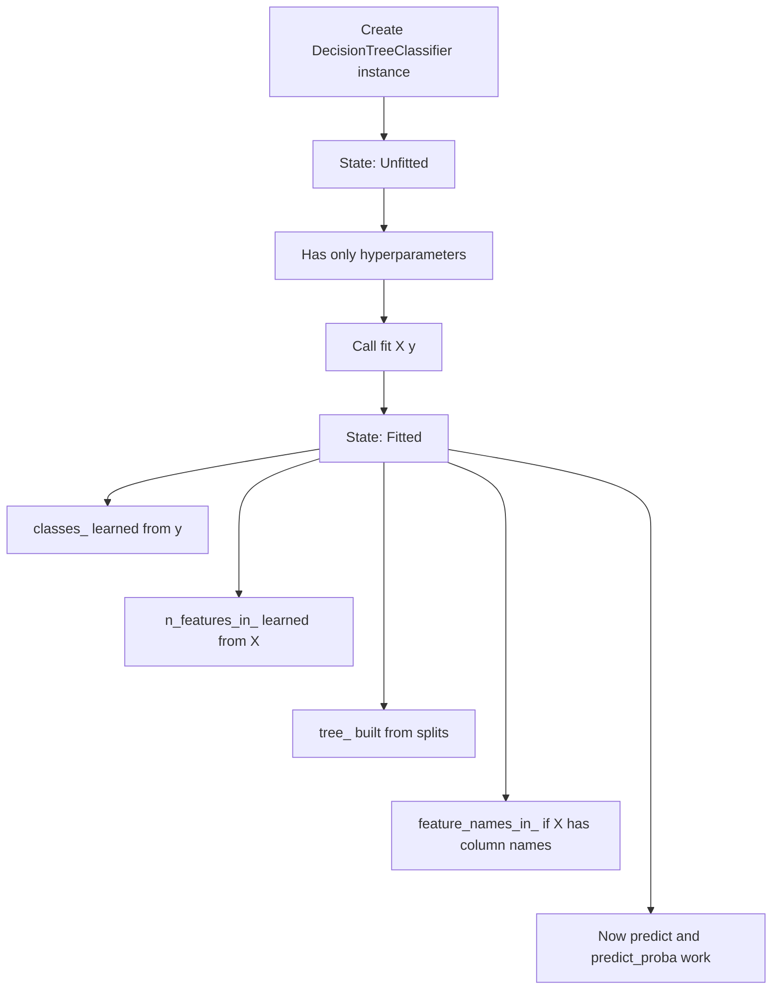

# Tree-Based Models

## 0-build.py

### Decision Tree Classifier

Write a function `build_decision_tree(min_samples_leaf, min_samples_split, random_state)` to create a decision tree classifier using Scikit-learn.

The decision tree uses the Gini impurity measure to evaluate the quality of splits.
No maximum depth is set, allowing the tree to grow until all leaves are pure or other stopping criteria are met.

Arguments:
- min_samples_leaf: Minimum number of samples required to be at a leaf node.
- min_samples_split: Minimum number of samples required to split an internal node.
- random_state: Seed used by the random number generator for reproducibility.

Returns:
- model: A Scikit-learn DecisionTreeClassifier instance.

_Required import: `from sklearn import tree`._

## 1-train.py

### Train a Tree-Based Classifier

Write a function `train_tree(clf, X, y)` to train a tree-based classifier using Scikit-learn.

Arguments:
- clf: A Scikit-learn classifier instance
- X: Input features
- y: Target labels

Returns: `None`

## 2-draw.py

### View the Decision Rules of a Trained Tree

Write a function `draw(clf, feature_names, class_names)` that displays the textual structure of a trained decision tree classifier using Scikit-learn.

Arguments:
- clf: A trained DecisionTreeClassifier instance from Scikit-learn
- feature_names: A list of the input feature names
- class_names: A list of the target class names

Returns: `None`. The function **prints** a readable text representation of the decision tree structure.

## 3-generate_predictions.py

### Generate Predictions

Write a function `generate_predictions(clf, X)` to generate predictions from a trained tree-based classifier using Scikit-learn.

Arguments:
- clf: A trained Scikit-learn classifier instance
- X: Feature matrix (NumPy array or pandas DataFrame)

Returns: A NumPy array containing the predicted class labels for the input samples.

## 4-evaluate.py

### Evaluate Classifier Performance

Write a function `evaluate(true_labels, predicted_labels, class_names)` that generates a detailed classification report using Scikit-learn.

This report should provide a comprehensive summary of the model’s performance for each class, including:
- precision
- recall
- F1-score

Arguments:
- true_labels: Ground truth labels
- predicted_labels: Predicted labels
- class_names: List of class names corresponding to the label indices

Returns: A string containing the classification report generated by Scikit-learn.

_Required import: `from sklearn import metrics`._

## 5-pre_pruning.py

### Pre-Pruning

Write a function `prepruning(X, y, clf)` that uses Scikit-learn to perform a Grid Search for the best pre-pruning hyperparameters for a decision tree classifier.

The search explores the following hyperparameters:
- criterion: "gini" or "entropy"
- max_depth: integer values in the range [2, 5)
- min_samples_leaf: integer values in the range [2, 5)
- min_samples_split: integer values in the range [2, 5)

Arguments:
- X: Input features
- y: Target labels
- clf: An untrained DecisionTreeClassifier instance

Returns: A dictionary containing the best combination of hyperparameters found during the grid search.

_Required import: `from sklearn import model_selection`._

## 6-pruning_path.py

### (Post-Pruning) Retrieve the Pruning Path of a Decision Tree

Write a function `get_pruning_path(clf, X, y)` that retrieves the cost-complexity pruning path for a given decision tree classifier.

Arguments:
- clf: A DecisionTreeClassifier instance
- X: Input features
- y: Target labels

Returns:
- ccp_alphas: A NumPy array containing the effective alpha values used for pruning
- impurities: A NumPy array containing the total impurity of leaves at each corresponding alpha

## 7-prune_decision_tree.py

### (Post-Pruning) Train and Evaluate Decision Trees with Pruning

Write a function `prune_and_evaluate_trees(X_train, y_train, X_test, y_test, ccp_alphas, random_state, min_samples_leaf, min_samples_split)` that trains multiple decision tree classifiers over a range of cost-complexity pruning parameters (ccp_alpha) and evaluates their performance.

This function helps analyze how different pruning strengths affect model complexity and performance.

Arguments:
- X_train, y_train: Training data and labels
- X_test, y_test: Testing data and labels
- ccp_alphas: A NumPy array of pruning alpha values to use for training different trees.
- random_state: Integer seed for reproducibility.
- min_samples_leaf: (int) Minimum number of samples required at a leaf node
- min_samples_split: (int) Minimum number of samples required to split an internal node

Returns:
- clfs: A list of trained DecisionTreeClassifier instances, each corresponding to a ccp_alpha value.
- train_scores: A list of training accuracy scores for each classifier.
- test_scores: A list of testing accuracy scores for each classifier.

_Required import: `from sklearn import tree` and from previous modules: `train_tree = __import__('1-train').train_tree`_

## 8-best_ccp_alpha.py

### (Post-Pruning) Best ccp_alpha for Pruning

Write a function `get_best_alpha(clfs, train_scores, test_scores, ccp_alphas)` that selects the best pruning value ccp_alpha for a set of trained decision trees.

This function first identifies the model(s) that achieve the highest test accuracy.
If multiple models share this same test accuracy, it selects the one with the smallest difference between training and test accuracy to favor better generalization.
In the event of a further tie, the model associated with the largest ccp_alpha is chosen to promote a simpler, more regularized tree.

Arguments:
- clfs: List of trained DecisionTreeClassifier instances, each trained with a different ccp_alpha.
- train_scores: List of training accuracy scores corresponding to each classifier in clfs.
- test_scores: List of test accuracy scores corresponding to each classifier in clfs as well.
- ccp_alphas: List or array of ccp_alpha values used to train the classifiers.

Returns:
- best_alpha: The most appropriate ccp_alpha value based on test accuracy and generalization.
- best_clf: The trained classifier associated with the best alpha.

## 9-random_forest.py

### Random Forest Classifier

Write a function `random_forest(n_estimators, random_state)` to create a random forest classifier using Scikit-learn.

Arguments:
- n_estimators: Number of trees in the forest.
- random_state: Seed used by the random number generator for reproducibility.

Returns a model: A Scikit-learn RandomForestClassifier instance.

_Required import: `from sklearn import ensemble`._

## 10-feature_importance.py

### Feature Importance with Random Forest

Write a function `feature_importance(rf)` that computes and returns the feature importances from a trained random forest model.

Arguments:
- rf: A trained Scikit-learn RandomForestClassifier instance.

Returns:
- importances: A NumPy array of feature importance scores.
- indices: A NumPy array of feature indices sorted from least to most important (ascending order).

_Required import: `import numpy as np`._

## 11-boosting.py

### Boosting
Write a function `compare_boosting_classifiers(name, n_estimators, random_state)` that initializes and returns an untrained boosting classifier based on the specified algorithm name.

Requirements:
- [ ] Initialize the selected model with the specified n_estimators and random_state.
- [ ] For LightGBM, verbose is set to -1 to suppress training logs.
- [ ] Raise a ValueError with the message “Unknown model name '{name}'” if the provided model name is invalid.

Arguments:
- name (str): Name of the boosting algorithm. Must be one of:
    - 'adaboost' — returns an AdaBoostClassifier
    - 'gradientboosting' — returns a GradientBoostingClassifier
    - 'xgboost' — returns an XGBClassifier
    - 'lightgbm' — returns an LGBMClassifier
    - n_estimators (int): Number of boosting iterations (trees).
    - random_state (int): Random seed for reproducibility.

Returns: An untrained instance of the selected boosting classifier.

_Required import: `from sklearn import ensemble`, `import xgboost as xgb`, `import lightgbm as lgb`_